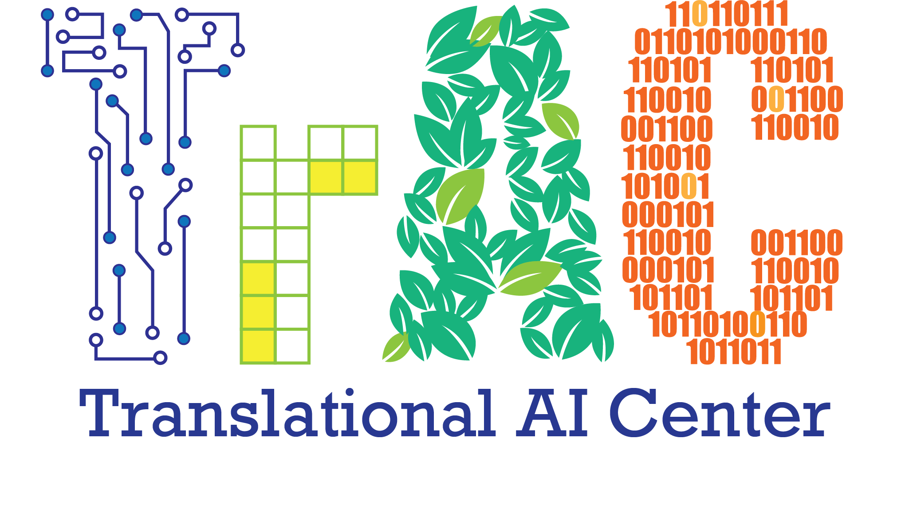

# Welcome to TrAC Training on Intro to Cloud-based Deep Learning

Hi all! welcome to TrAC training on **Intro to Cloud-based Deep Learning**. This tutorial is possible because of the resources coming from [AIIRA](https://aiira.iastate.edu/), [Cyverse](https://cyverse.org/), [JetStream2](https://jetstream-cloud.org/). 

  

  
  

  
   
  

<!-- 
{ width="450" } 
{ width="300"}
 -->

## Before you get started, please read our:

1. [:material-scale-balance: Code of Conduct](./getting_started/code_conduct.md)

2. [:fontawesome-solid-gears: Logistics](./getting_started/logistics.md)

3. [:material-timetable: Schedule](./getting_started/schedule.md)

## :material-cloud-tags: Part 1 

Work Cloud Natively with CyVerse & Jetstream-2

1. [Introduction to CyVerse cyberinfrastructure](https://learning.cyverse.org){target=_blank} 

      * [Discovery Environment Data Science Workbench](https://de.cyverse.org){target=_blank}
      * :material-database-cog: Navigating the [iRODS](https://irods.org) CyVerse Data Store
      * [JupyterHub on JetStream-2 OpenStack Cloud](http://tractrain2022.cyverse.org/){target=_blank}

2. Containers with :material-docker: Docker and :material-kubernetes: Kubernetes
      * Introduction to Deep Learning with Project Jupyter 
      * Data Management 
      * Data Analysis 
      * Concepts in training with a predefined standard network architecture 
      * Performing model inference
      * Version control and Reproducibility

## :material-language-python: Part II

1. Introduction to GPU computing 
      * Setting up your analysis environment for programming in Python 

-----------------------------------------------------------------------

**Funding and Citations:**

AI Institute for Resilient Agriculture (AIIRA) is supported by the National Science Foundation [{width="25"}](https://nsf.gov) and United States Department of Agriculture - National Institute of Food and Agriculture award \#2021-67021-35329

CyVerse is funded entirely by the National Science Foundation [{width="25"}](https://nsf.gov) under Award Numbers:

    

Please cite CyVerse appropriately when you make use of our resources; see [CyVerse citation policy](https://cyverse.org/policies/cite-cyverse).

